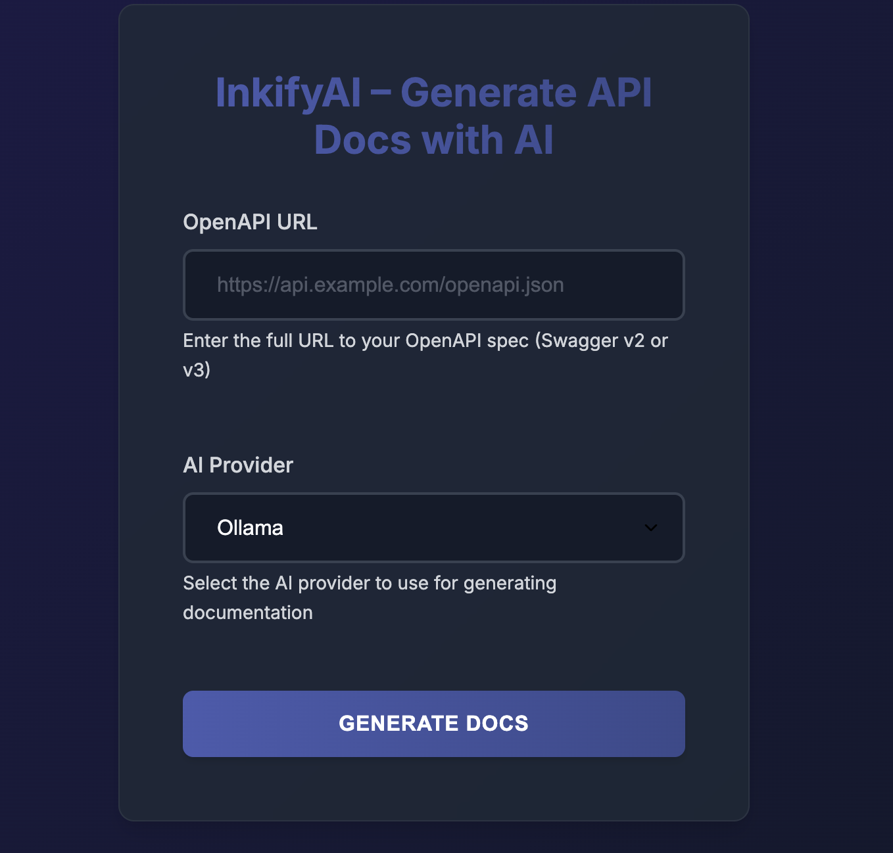

# InkifyAI - AI-powered OpenAPI Documentation Generator

InkifyAI is a web application that uses AI to automatically generate comprehensive, human-readable
documentation from OpenAPI specifications (Swagger v2 or v3). It leverages large language models to
create documentation that is both technically accurate and easy to understand.

> **Name Origin**: InkifyAI comes from the phrase "Let AI ink your APIs" - reflecting our mission to
> use artificial intelligence to document your API specifications elegantly and efficiently.

<p align="center"></p>

## Features

- **Simple Web Interface**: Upload your OpenAPI specification URL and get documentation in seconds
- **AI-Powered Documentation**: Uses LLMs to generate high-quality, human-readable documentation
- **Markdown Output**: Documentation is generated in Markdown format, ready for use in GitBook or
  other documentation platforms
- **Multiple LLM Support**: Designed to work with various LLM providers, currently supporting Ollama
- **OpenAPI Compatibility**: Supports both OpenAPI v3 and Swagger v2 specifications
- **Caching**: Caches OpenAPI specifications for improved performance
- **Streaming Responses**: Processes LLM responses as they arrive for efficient generation

## Prerequisites

- Java 21 or higher
- Maven 3.6 or higher
- [Ollama](https://ollama.ai/) installed and running locally with the `llama3.2` model
    - You can install Ollama from [ollama.ai](https://ollama.ai/)
    - Pull the llama3.2 model with: `ollama pull llama3.2`

## Installation

1. Clone the repository:
   ```bash
   git clone https://github.com/jenderenco/inkifyai-doc-generator.git
   cd doc-generator
   ```

2. Build the application:
   ```bash
   ./mvnw clean package
   ```

3. Run the application:
   ```bash
   ./mvnw spring-boot:run
   ```

4. Access the application at [http://localhost:8080](http://localhost:8080)

## Usage

1. Ensure Ollama is running with the llama3.2 model (if using the default Ollama provider):
   ```bash
   ollama serve
   ```

2. Open your browser and navigate to [http://localhost:8080](http://localhost:8080)

3. Enter the URL of your OpenAPI specification. You can use these example URLs for testing:
    - Swagger v2: `https://petstore.swagger.io/v2/swagger.json`
    - OpenAPI v3: `https://petstore3.swagger.io/api/v3/openapi.json`

4. Select your preferred AI provider from the dropdown (default: Ollama)

5. Click "Generate Docs" and wait for the AI to process your specification

6. The generated documentation will be displayed in Markdown format, which you can copy and use in
   your documentation platform

## Configuration

The application can be configured through the `application.yml` file:

```yaml
spring:
  application:
    name: "inkifyai-doc-generator"
  profiles:
    active: "ollama"

llm:
  ollama:
    url: http://localhost:11434  # URL of your Ollama instance
    model: llama3.2              # LLM model to use
    temperature: 0.7             # Temperature setting for generation

openapi:
  cache-size: 100                # Number of OpenAPI specs to cache (0 to disable)
  validate-url: true             # Whether to validate URLs before fetching
  read-timeout: 10000            # Read timeout in milliseconds
  max-retries: 3                 # Maximum number of retry attempts
  retry-delay: 1000              # Delay between retries in milliseconds
```

You can add additional LLM providers by implementing the `LlmClient` interface and registering them as Spring beans.

## How It Works

1. The application fetches the OpenAPI specification from the provided URL (with caching for improved performance)
2. It parses the specification (supporting both OpenAPI v3 and Swagger v2 formats) to extract relevant information
3. It constructs a detailed prompt for the LLM based on the parsed specification
4. It sends the prompt to the selected LLM provider (default: Ollama) and processes the streaming response
5. It returns the generated documentation in Markdown format, ready for use in documentation platforms

## Contributing

Contributions are welcome! Here's how you can contribute:

1. Fork the repository
2. Create a feature branch: `git checkout -b feature/my-new-feature`
3. Commit your changes: `git commit -am 'Add some feature'`
4. Push to the branch: `git push origin feature/my-new-feature`
5. Submit a pull request

## License

This project is licensed under the MIT License - see the LICENSE file for details.

## Acknowledgements

- [Spring Boot](https://spring.io/projects/spring-boot) for the web framework
- [Ollama](https://ollama.ai/) for local LLM inference
- [Swagger Parser](https://github.com/swagger-api/swagger-parser) for OpenAPI specification parsing
